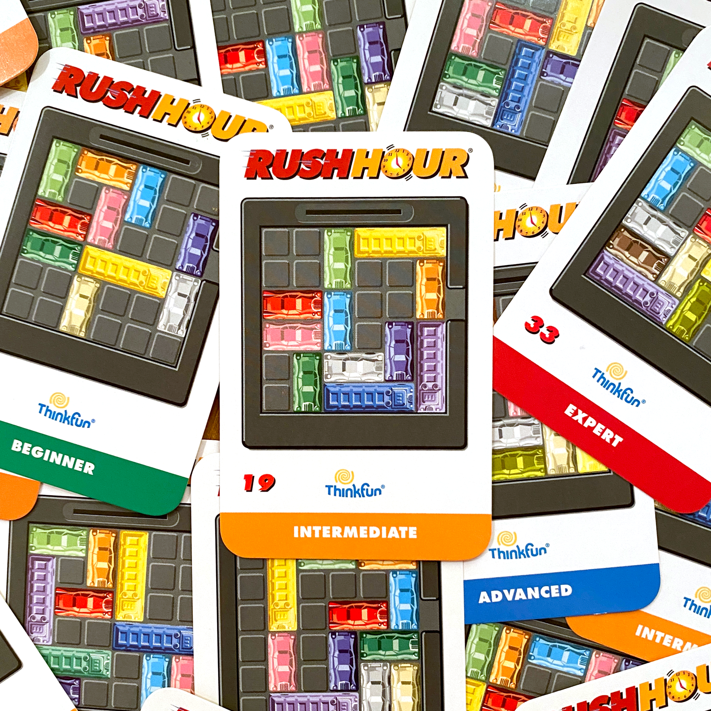

# Rush Hour
The goal of the game is to move the red car (represented in the program by 'X') to the exit.

# Rush Hour Puzzle Solver
A program that uses the best-first search A* algorithm to solve any Rush Hour puzzle board in the optimal number of moves, implemented in Python3. 

The program works by adding the given board to a list, generating/adding the possible next moves from the board to the list, and sorting that list by its calculated heuristic cost. Then, the front of the list is explored repeating the same process until the solution (where the red car is at the exit) is found.
